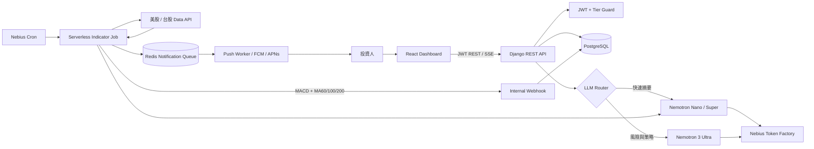

# PickingGeek / MarketPulse AI

PickingGeek 是個人 AI 投資研究 Copilot，聚焦美股與台股，將 MACD、60/100/200 日均線、每日訊號通知與 Nemotron AI 分析整合在同一個工作介面。Free 用戶最多追蹤 1 支股票，Pro 用戶可追蹤不限支數。

> 本專案提供研究工具，不構成投資建議，也不承諾任何報酬。

## 系統架構



### 主要資料流

1. React 透過 JWT 呼叫 Django REST API，取得自選股與最新指標。
2. `UserStock.save()` 在 PostgreSQL transaction 中鎖定使用者，Free Tier 只能新增一筆。
3. 台股與美股收盤後由兩個 Nebius Cron 觸發 Job，抓取至少 260 個交易日資料。
4. Job 計算 MACD、MA60/100/200，呼叫 Nano 產生短摘要，再用共享密鑰寫入 Django webhook。
5. Django 更新 `TechnicalIndicatorCache`，為追蹤者建立 `NotificationQueue` 紀錄。
6. AI Chat 使用 SSE 串流；Router 依問題長度與風險、策略關鍵字選擇 Nano 或 Ultra。

## 目錄

```text
backend/                 Django REST API、JWT、Models、LLM Router
frontend/                React + Vite 儀表板
jobs/                    Nebius Serverless 每日指標 Job
docker-compose.yml       PostgreSQL 16 + Redis 7
.env.example             環境變數範本
```

## 資料模型

- `User`: Django 使用者加上 `tier = FREE | PRO`。
- `Stock`: `symbol + market` 唯一，美股與台股共用一套模型。
- `UserStock`: 自選股關聯，模型與 API 兩層執行 Free Tier 上限。
- `TechnicalIndicatorCache`: 最新收盤價、MACD、MA60/100/200、突破狀態、AI 摘要與圖表點。
- `NotificationQueue`: 待推播訊息，後續可接 FCM、APNs 或 Email worker。

## 本機啟動

### 1. 後端

Windows PowerShell：

```powershell
Copy-Item .env.example .env
python -m venv .venv
.\.venv\Scripts\python -m pip install -r requirements.txt
.\.venv\Scripts\python backend\manage.py migrate
.\.venv\Scripts\python backend\manage.py seed_demo
.\.venv\Scripts\python backend\manage.py runserver
```

Demo 帳號為 `demo`，密碼為 `demo1234`。取得 JWT：

```http
POST /api/auth/token/
Content-Type: application/json

{"username":"demo","password":"demo1234"}
```

### 2. 前端

```powershell
Set-Location frontend
npm install
npm run dev
```

開啟 `http://localhost:5173`。前端可先展示預設 Hackathon 資料；串流 AI 需先把 JWT access token 放入瀏覽器的 `localStorage.access_token`。

### 3. PostgreSQL 與 Redis

```powershell
docker compose up -d
```

若不啟動 PostgreSQL，Django 開發環境會自動使用 SQLite。正式部署請使用 `.env.example` 的 PostgreSQL `DATABASE_URL`。

## Nebius 設定

必要環境變數：

```dotenv
NEBIUS_API_KEY=...
NEBIUS_API_KEY_FILE=Nebius_Picking_Geek_AI_API.txt
NEBIUS_BASE_URL=https://api.tokenfactory.nebius.com/v1
NANO_MODEL=nvidia/NVIDIA-Nemotron-3-Nano-30B-A3B
SUPER_MODEL=nvidia/nemotron-3-super-120b-a12b
ULTRA_MODEL=nvidia/Nemotron-3-Ultra-550b-a55b
MARKET_DATA_URL=https://your-market-adapter.example/prices
INTERNAL_INDICATOR_WEBHOOK=https://api.example.com/api/internal/indicators/
JOB_WEBHOOK_SECRET=use-a-long-random-value
REDIS_URL=redis://redis:6379/0
```

建議排程使用 `Asia/Taipei`：

- 台股：週一至週五 `14:10`，即收盤後約 40 分鐘。
- 美股：因夏令時間不同，使用 UTC 排程或拆成 DST / non-DST 兩組排程，收盤後約 30 分鐘執行。
- Job entry point：`jobs.daily_indicator_job:handler`。

實際 Nebius Model ID 可能隨帳戶可用模型調整，因此 `NANO_MODEL` 與 `ULTRA_MODEL` 都設計成環境變數。
本機優先讀取專案根目錄的 `Nebius_Picking_Geek_AI_API.txt`；檔案已加入 `.gitignore`。正式環境仍建議使用 Nebius Secrets 注入 `NEBIUS_API_KEY`。

## API

| Method | Endpoint | 用途 |
| --- | --- | --- |
| `POST` | `/api/auth/token/` | 取得 JWT |
| `GET` | `/api/stocks/` | 搜尋股票與最新指標 |
| `GET/POST/DELETE` | `/api/watchlist/` | 管理自選股與方案限制 |
| `GET` | `/api/stocks/{id}/indicator/` | 讀取技術指標 |
| `POST` | `/api/ai/analyze/` | SSE 串流 AI 分析 |
| `POST` | `/api/internal/indicators/` | Serverless Job 寫入指標 |

## LLM Router 規則

- `mode=quick`：固定 Nano，適合一句話指標解讀。
- `mode=deep`：固定 Ultra，適合深度風險與策略報告。
- `mode=auto`：長問題或包含「風險、策略、估值、財報、大盤、投資組合」等詞彙時使用 Ultra，其餘使用 Nano。

## 驗證

```powershell
.\.venv\Scripts\python backend\manage.py check
.\.venv\Scripts\python backend\manage.py check_nebius --chat --stream
.\.venv\Scripts\python backend\manage.py test marketpulse
Set-Location frontend
npm run build
```
